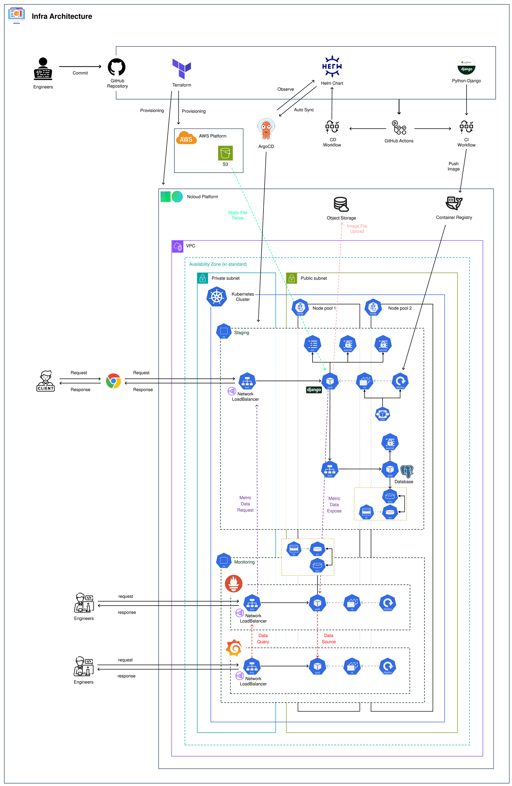
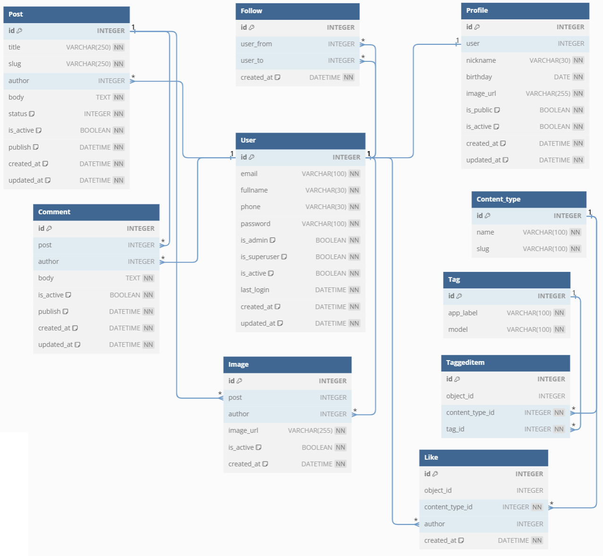
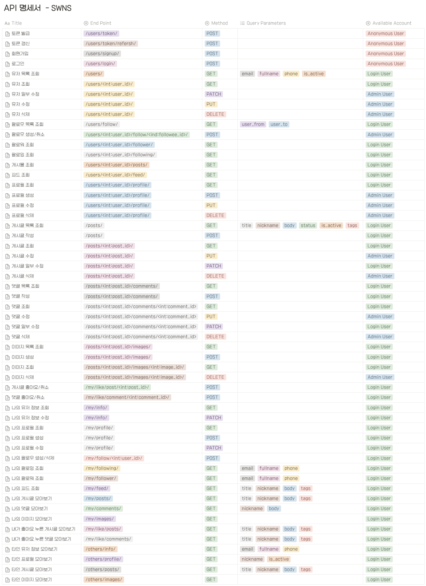
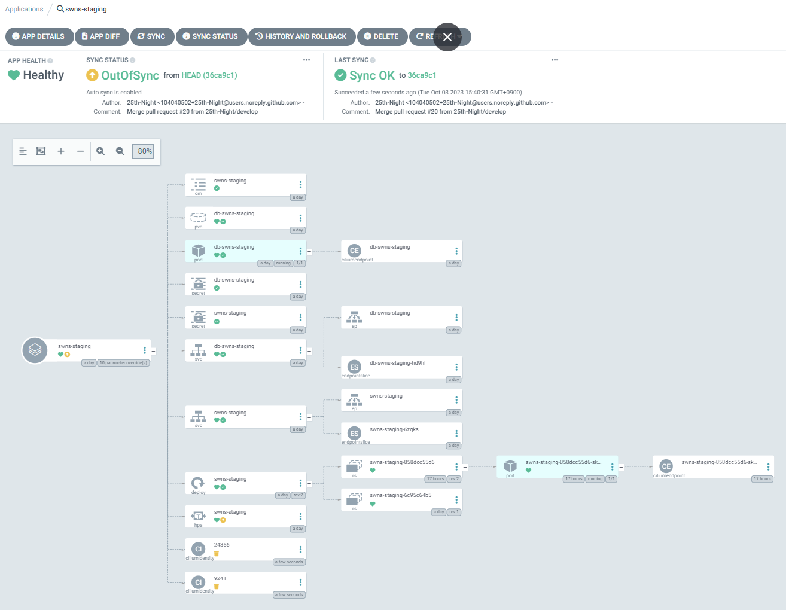
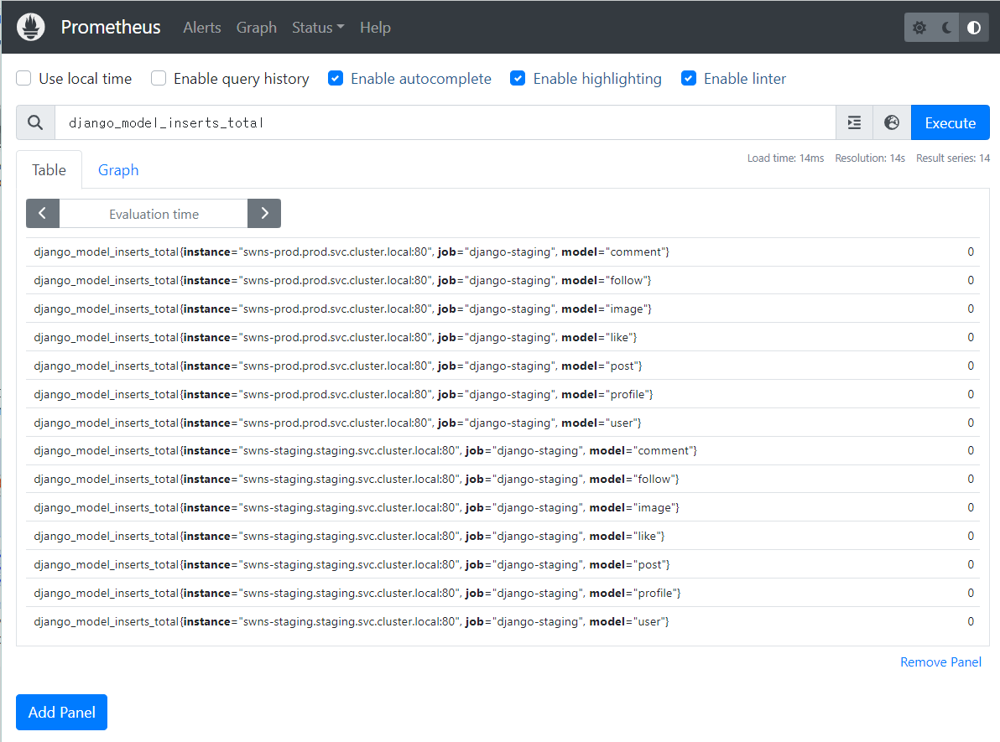
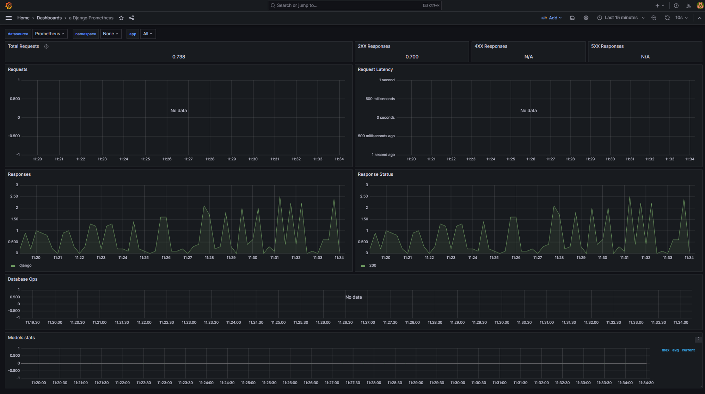

# 📢 소셜 네트워크 서비스 개발 프로젝트 2차

### 🔔 참고
> 📌 <u>**[소셜 네트워크 서비스 개발 프로젝트 1차 - `Original` Repository](https://github.com/likelion-backend-6th/TrackProject_1_ChoiSeonWoo)</u>** - 231031 이후 접속 불가 <br>
> 📌 <u>**[소셜 네트워크 서비스 개발 프로젝트 1차 - `Mirror` Repository](https://github.com/25th-Night/swns-1st)</u>** <br>
> 📌 <u>**[소셜 네트워크 서비스 개발 프로젝트 2차 - `Original` Repository](https://github.com/likelion-backend-6th/TrackProject_2_ChoiSeonWoo)</u>** - 231031 이후 접속 불가 <br>
> &nbsp;&nbsp;&nbsp;&nbsp;&nbsp; → 참고: **`k8s` 작업부터 이어서 진행하기 위해 `미러링` 를 통해 기존 작업 코드 및 커밋 내역을 복제후 진행**

<br>

## 📆 프로젝트 기간

| 차수     | 기간                      |
|--------|-------------------------|
| **1차** | `23.09.04` ~ `23.09.08` |
| **2차** | `23.09.12` ~ `23.09.19` |
| **추가** | `23.09.21` ~ `23.10.03` |

<br>

## 🗒️ 프로젝트 개요

- Python, Django를 이용한 소셜 네트워크 서비스 애플리케이션 개발
- Django REST Framework, drf-spectacular를 이용한 백엔드 API 개발, API Docs 제공
- Docker를 이용한 컨테이너 형태로의 배포
- GitHub Actions를 이용한 CI/CD pipeline 구축
- Terraform을 이용한 IaC 구현 및 관리
- NCloud, AWS를 이용한 클라우드 서버 환경 구성
- Helm Chart, ArgoCD를 이용하여 Kubernetes에 배포
- Prometheus, Grafana를 통한 모니터링

<br>

## 🗼 Architecture



<br>

## 🏤 Infra

### 🖥 GitHub Repository

**코드 및 버전 관리**

- 작업 환경 별 Branch 분리

| Branch    | 용도               | Merge to         |
|-----------|------------------|------------------|
| `feat`    | 기능 개발 및 테스트      | `develop` branch |
| `develop` | 정상 동작 확인 및 버그 수정 | `main` branch    |
| `main`    | 서비스 배포           | -                |

<br>

### 🚥 GitHub Actions

**지속적 통합 (CI) 및 지속적 배포 (CD)를 구축**

**1️⃣ Test**

| 분류    | 설명                                                                                        |
|-------|:------------------------------------------------------------------------------------------|
| 조건    | `feature` 혹은 `fix` 브랜치로 push되었을 때                                                         |
| 진행    | - black 라이브러리로 Lint 체크 <br> - `docker-compose`를 이용한 테스트 코드 실행                             |
| 확인 대상 | - 모든 파일과 디렉토리 <br> - 단, `infra` 및 `script`, `helm`, `monitoring` 디렉토리 및 그 하위 파일과 디렉토리은 제외 |

**2️⃣ CI**

| 분류 | 설명                                                                          |
|----|:-------------------------------------------------------------------------------|
| 조건 | - `Pull Request`가 `closed`되었을 때 <br> - 새로운 버전이 `Release`되었을 때    |
| 진행 | - `Pull Request`가 `closed`된 경우 : `Latest` 버전과 `TimeStamp` 버전 docker image를 build 후 push <br> - 새로운 버전이 `Release`된 경우 : `Release Tag Name` 버전 docker image를 build 후 push <br> - 이미지 push는 `Ncloud Container Registry` 로 진행 |

**3️⃣ CD**

| 분류 | 설명                                                                                                                                            |
|----|:----------------------------------------------------------------------------------------------------------------------------------------------|
| 조건 | - 새로운 버전이 `Release`되었을 때                                                                                                                      |
| 진행 | - Helm Chart의 `Chart.yaml` 파일 내 `appVersion`을 `Release Tag Name`으로 변경  <br> - ArgoCD에서 해당 변화를 감지하여 `Release Tag Name` 버전의 이미지를 각 stage 서버에 배포 |


<br>

### ⛵ Docker
**컨테이너화된 애플리케이션 이미지를 생성 및 관리**

- 이미지 버전 관리를 위하여 조건에 따라 `TIMESTAMP` Ver. 과 `latest` Ver. , `Release` Ver. 으로 docker image를 생성
- 생성된 이미지는 클라우드 환경(NCloud Container Registry)에 Push
- 롤백 혹은 백업, 로그 확인 목적으로 `Latest` Ver. 이미지,`Timestamp` Ver. 이미지를 push하여 보관
- 실제 배포에는 `release` Ver. 이미지를 사용

<br> 

### 💻 Terraform

**클라우드 환경에서 인프라를 코드로 관리 및 프로비저닝**
- `S3` Backend를 활용한 원격 환경에서의 Terraform 상태 파일 관리

**Shared Module**
- AWS `S3` : S3 Object Storage 리소스 생성
- NCP `Vpc` : VPC 리소스 생성
- NCP `Subnet` : Subnet 리소스 생성
- NCP `Cluster` : Nks Cluster 리소스 생성
- NCP `Node_pool` : Nks Node Pool 리소스 생성
- NCP `Server` : Access Group, Network Interface, Init Script, Server 및 관련 리소스 생성
- NCP `LoadBalancer` : Target Group, LoadBalancer 및 관련 리소스 생성

**Child Module**
- `k8s` : `main` 브랜치 에서 관리되는 코드를 사용하여 배포에 사용될 Kubernetes 리소스를 생성

<br>

### ⛅ AWS, NCP

**클라우드 리소스를 활용하여 애플리케이션 서비스를 SaaS 형태로 제공**

- 기본 환경 구축은 NCloud에서 Kubernetes Cluster 내에 진행
- 기타 특이사항
  - `AWS` : 정적 파일 서빙을 위하여 s3 사용
  - `NCloud` : 이미지 업로드 기능을 통한 이미지 저장에 Object Storage 사용

<br>

### 🎇 Helm

**Kubernetes 애플리케이션 관리**

- Helm 차트를 통해 애플리케이션 관련 리소스를 정의하고 배포
- 1차에서 Terraform으로 생성한 모든 리소스를 Helm 차트를 이용하여 생성하는 방식으로 대체

<br>

### 🐙 ArgoCD

**Kubernetes 애플리케이션 배포 및 관리 자동화**

- Helm 차트를 통해 작성된 Kubernetes Manifest 파일을 GitHub Repository에서 관리
- 해당 Repository의 변화를 감지하여 자동으로 Kubernetes 환경에 새 버전을 배포

<br>

### 🔥 Prometheus

**애플레케이션 모니터링 도구로 사용**

- `django-prometheus`를 이용하여 보다 쉽게 `Prometheus` 모니터링 환경을 구축
- 애플리케이션 및 시스템의 성능 및 상태를 실시간으로 관리

<br>

### 🌞 Grafana

**Prometheus로 수집된 데이터 시각화**

- Prometheus 데이터 소스를 정의하고, 해당 데이터 소스에 쿼리를 통해 데이터를 동적으로 조회
- 조회 결과를 통해 얻어진 metric 데이터를 시각화하여 대시보드를 구성


<br>

## 📖 프로젝트 주요 기능

### 0️⃣ 권한 및 정책

- 사용자 계정은 관리자와 일반 사용자로 구분되어 API에 대한 접근 권한이 부여됨.
- 관리자 계정은 모든 기능을 이용 가능.
- `팔로우`, `좋아요`를 제외한 나머지 데이터의 삭제 요청은 `is_active` 필드 값을 `False`로 변경하는 것으로 처리됨.

### 1️⃣ 유저

- JWT를 이용한 토큰 인증
- 사용자는 전체 혹은 나를 제외한 유저 목록 조회 가능
- 사용자는 나를 제외한 유저 목록 조회 시, 각 유저의 프로필 정보도 확인 가능
- 사용자는 내 정보 조회/수정/삭제 가능
- 사용자는 조건에 따른 유저 정보 검색 가능

### 2️⃣ 프로필

- 사용자는 전체 혹은 나를 제외한 프로필 목록 조회 가능
- 사용자는 전체 혹은 나를 제외한 프로필 목록 조회 시, 해당 프로필의 유저 정보도 확인 가능
- 사용자는 내 프로필 조회/생성/수정 가능
- 사용자는 프로필에 사진을 추가 가능
- 사용자는 조건에 따른 프로필 검색 가능

### 3️⃣ 팔로우

- 사용자는 다른 사용자를 `팔로우` 및 `언팔로우` 가능
- 사용자는 following (내가 `팔로우`한 사람들) 목록 확인 가능
- 사용자는 follower (나를 `팔로우`한 사람들) 목록 확인 가능
- 사용자는 `팔로우`한 사람들이 올린 게시글을 모아 볼 수 있음
- 사용자는 나를 제외한 유저 목록 조회 시, 해당 유저에 대한 `팔로우` 여부 확인 가능

### 4️⃣ 게시글
- 사용자는 전체 게시글 혹은 나를 제외한 유저의 게시글 목록 조회 가능
- 사용자는 본인의 게시글 조회/수정/삭제 가능
- 게시글 작성 시, `임시저장`/`공개` 상태 지정이 가능
- `임시저장` 상태의 게시글은 사용자 본인만 조회 가능
- 사용자는 본인이 작성한 게시글을 모아 볼 수 있음
- 사용자는 본인이 팔로우한 사람들의 게시글 모아보기 가능
- 사용자는 조건에 따른 게시글 검색 가능

### 5️⃣ 댓글
- 사용자는 특정 게시글에 달린 댓글 목록 조회 가능
- 사용자는 댓글 조회/생성/수정/삭제 가능
- 사용자는 본인이 작성한 댓글을 모아 볼 수 있음
- 사용자는 조건에 따른 댓글 검색 가능

### 6️⃣ 이미지
- 사용자는 게시글에 달린 이미지 목록 확인 가능
- 사용자는 게시글에 이미지를 조회/추가/삭제 가능
- 사용자는 본인이 업로드한 이미지를 모아보기 가능

### 7️⃣ 좋아요
- 사용자는 게시글에 `좋아요` 누르기/취소 가능
- 사용자는 댓글에 `좋아요` 누르기/취소 가능
- 사용자는 본인이 `좋아요` 누른 게시글을 모아보기 가능
- 사용자는 본인이 `좋아요` 누른 댓글을 모아보기 가능
- 게시글 혹은 댓글 조회 시, `좋아요` 수 확인 가능

<br>

## 🪓 주요 설치 패키지/모듈

|    종류     |                이름                 |    버전    |
|:---------:|:---------------------------------:|:--------:|
| Language  |            **python**             |   3.11   |
| Framework |            **Django**             |  4.2.4   |
| Database  |          **PostgreSQL**           |    13    |
|  Library  |           **gunicorn**            |  21.2.0  |
|  Library  |        **psycopg2-binary**        |  2.9.7   |
|  Library  |      **djangorestframework**      |  3.14.0  |
|  Library  | **djangorestframework-simplejwt** |  5.3.0   |
|  Library  |      **drf-nested-routers**       |  0.93.4  |
|  Library  |        **drf-spectacular**        |  0.26.4  |
|  Library  |    **drf-spectacular-sidecar**    | 2023.9.1 |
|  Library  |             **boto3**             | 1.28.44  |
|  Library  |        **django-storages**        |   1.14   |
|  Library  |         **django-filter**         |   23.2   |
|  Library  |         **django-taggit**         |  4.0.0   |
|  Library  |            **Pillow**             |  10.0.0  |
|  Library  |             **Faker**             |  19.6.1  |
|  Library  |       **django-prometheus**       |  2.3.1   |

<br> 

## 📋 Database Schema

### 💾 User

| Column Name      | Data Type               | Constraint                                                       |
|------------------|-------------------------|------------------------------------------------------------------|
| **id**           | INTEGER                 | PRIMARY KEY                                                      |
| **email**        | VARCHAR(max_length=100) | UNIQUE , NOT NUL                                                 |
| **fullname**     | VARCHAR(max_length=30)  | NOT NULL                                                         |
| **phone**        | VARCHAR(max_length=30)  | UNIQUE,  NOT NULL                                                |
| **password**     | VARCHAR(max_length=100) |                                                                  |
| **is_admin**     | BOOLEAN                 | NOT NULL, DEFAULT : False                                        |
| **is_superuser** | BOOLEAN                 | NOT NULL, DEFAULT : False                                        |
| **is_active**    | BOOLEAN                 | NOT NULL, DEFAULT : True                                         |
| **last_login**   | DATETIME                | NULL                                                             |
| **created_at**   | DATETIME                | DEFAULT CURRENT_TIMESTAMP, NOT NULL                              |
| **updated_at**   | DATETIME                | DEFAULT CURRENT_TIMESTAMP, ON UPDATE CURRENT_TIMESTAMP, NOT NULL |

### 💾 Profile

| Column Name    | Data Type               | Constraint                                                       |
|----------------|-------------------------|------------------------------------------------------------------|
| **id**         | INTEGER                 | PRIMARY KEY                                                      |
| **user**       | INTEGER                 | FOREIGN KEY REFERENCES User(user_id), NOT NULL                   |
| **nickname**   | VARCHAR(max_length=30)  | UNIQUE, NOT NULL                                                 |
| **birthday**   | DATE                    | NOT NULL                                                         |
| **image_url**  | VARCHAR(max_length=255) | NULL                                                             |
| **is_public**  | BOOLEAN                 | NOT NULL, DEFAULT : True                                         |
| **is_active**  | BOOLEAN                 | NOT NULL, DEFAULT : True                                         |
| **created_at** | DATETIME                | DEFAULT CURRENT_TIMESTAMP, NOT NULL                              |
| **updated_at** | DATETIME                | DEFAULT CURRENT_TIMESTAMP, ON UPDATE CURRENT_TIMESTAMP, NOT NULL |

### 💾 Follow

| Column Name    | Data Type | Constraint                                     |
|----------------|-----------|------------------------------------------------|
| **id**         | INTEGER   | PRIMARY KEY                                    |
| **user_from**  | INTEGER   | FOREIGN KEY REFERENCES User(user_id), NOT NULL |
| **user_to**    | INTEGER   | FOREIGN KEY REFERENCES User(user_id), NOT NULL |
| **created_at** | DATETIME  | DEFAULT CURRENT_TIMESTAMP, NOT NULL            |

### 💾 Post

| Column Name    | Data Type               | Constraint                                                       |
|----------------|-------------------------|------------------------------------------------------------------|
| **id**         | INTEGER                 | PRIMARY KEY                                                      |
| **title**      | VARCHAR(max_length=250) | NOT NULL                                                         |                                                                  |
| **slug**       | VARCHAR(max_length=250) | UNIQUE, NOT NULL                                                 |
| **author**     | INTEGER                 | FOREIGN KEY REFERENCES User(user_id), NOT NULL                   |
| **body**       | TEXT                    | NOT NULL                                                         |
| **status**     | INTEGER                 | NOT NULL, DEFAULT : 0                                            |
| **is_active**  | BOOLEAN                 | NOT NULL, DEFAULT : True                                         |
| **publish**    | DATETIME                | DEFAULT CURRENT_TIMESTAMP,NOT NULL                               |
| **created_at** | DATETIME                | DEFAULT CURRENT_TIMESTAMP, NOT NULL                              |
| **updated_at** | DATETIME                | DEFAULT CURRENT_TIMESTAMP, ON UPDATE CURRENT_TIMESTAMP, NOT NULL |

### 💾 Comment

| Column Name    | Data Type | Constraint                                                       |
|----------------|-----------|------------------------------------------------------------------|
| **id**         | INTEGER   | PRIMARY KEY                                                      |
| **body**       | TEXT      | NOT NULL                                                         |                                                                  |
| **post**       | INTEGER   | FOREIGN KEY REFERENCES Post(post_id), NOT NULL                   |
| **author**     | INTEGER   | FOREIGN KEY REFERENCES User(user_id), NOT NULL                   |
| **body**       | TEXT      | NOT NULL                                                         |
| **is_active**  | BOOLEAN   | NOT NULL, DEFAULT : True                                         |
| **created_at** | DATETIME  | DEFAULT CURRENT_TIMESTAMP, NOT NULL                              |
| **updated_at** | DATETIME  | DEFAULT CURRENT_TIMESTAMP, ON UPDATE CURRENT_TIMESTAMP, NOT NULL |

### 💾 Image

| Column Name    | Data Type               | Constraint                                                       |
|----------------|-------------------------|------------------------------------------------------------------|
| **id**         | INTEGER                 | PRIMARY KEY                                                      |
| **name**       | VARCHAR(max_length=250) | NOT NULL                                                         |                                                                  |
| **post**       | INTEGER                 | FOREIGN KEY REFERENCES Post(post_id), NOT NULL                   |
| **author**     | INTEGER                 | FOREIGN KEY REFERENCES User(user_id), NOT NULL                   |
| **image_url**  | VARCHAR(max_length=255) | NULL                                                            |
| **is_active**  | BOOLEAN                 | NOT NULL, DEFAULT : True                                         |
| **created_at** | DATETIME                | DEFAULT CURRENT_TIMESTAMP, NOT NULL                              |

### 💾 Like

| Column Name         | Data Type | Constraint                                                     |
|---------------------|-----------|----------------------------------------------------------------|
| **id**              | INTEGER   | PRIMARY KEY                                                    |
| **content_type_id** | INTEGER   | FOREIGN KEY REFERENCES Content_type(content_type_id), NOT NULL |
| **object_id**       | INTEGER   | NOT NULL                                                       |
| **user**            | INTEGER   | FOREIGN KEY REFERENCES User(user_id), NOT NULL                 |
| **created_at**      | DATETIME  | DEFAULT CURRENT_TIMESTAMP, NOT NULL                            |

### 💾 Content_type

| Column Name   | Data Type                | Constraint  |
|---------------|--------------------------|-------------|
| **id**        | INTEGER                  | PRIMARY KEY |
| **app_label** | VARCHAR (max_length=100) | NOT NULL    |
| **model**     | VARCHAR (max_length=100) | NOT NULL    |

### 💾 Tag

| Column Name | Data Type                | Constraint  |
|-------------|--------------------------|-------------|
| **id**      | INTEGER                  | PRIMARY KEY |
| **name**    | VARCHAR (max_length=100) | NOT NULL    |
| **slug**    | VARCHAR (max_length=100) | NOT NULL    |

### 💾 Taggeditem

| Column Name         | Data Type | Constraint                                                     |
|---------------------|-----------|----------------------------------------------------------------|
| **id**              | INTEGER   | PRIMARY KEY                                                    |
| **object_id**       | INTEGER   | NOT NULL                                                       |
| **content_type_id** | INTEGER   | FOREIGN KEY REFERENCES Content_type(content_type_id), NOT NULL |
| **tag_id**          | INTEGER   | FOREIGN KEY REFERENCES Tag(tag_id), NOT NULL                   |

<br>

## 📅 ERD



<br>

## 📃 API 명세서
> 하단 Notion 링크를 통해 접속하여 확인 가능



<br>

## 📸 주요 화면

### 📄 OpenAPI Docs


### 🐙 ArgoCD



### 🔥 Prometheus



### 🌞 Grafana



<br>

## 📑 Check List

### 0️⃣0️⃣ DB & API설계

- [x]  DB 설계
- [x]  API 설계

### 0️⃣1️⃣ 초기 셋팅

- [x]  github 관련 설정
- [x]  가상환경 및 장고 설치
- [x]  프로젝트 및 주요 앱 생성
- [x]  `gunicorn` 설정
- [x]  `requirements.txt` 작성
- [x]  stage에 따른 설정 파일 분리
- [x]  환경변수 관련 디렉토리 및 파일 생성

### 0️⃣2️⃣ Docker 셋팅

- [x]  Dockerfile for Django - 작성
- [x]  관련 스크립트 파일 작성
- [x]  Django 프로젝트에서 psycopg2 사용 설정
- [x]  Dockerfile for nginx in ubuntu - 작성
- [x]  관련 스크립트 파일 작성
- [x]  docker-compose.yml for local 환경 - 작성
- [x]  local 환경에서 사용할 환경변수 파일 작성
- [x]  docker-compose.yml for test - 작성

### 0️⃣3️⃣ Terraform 셋팅

- [x]  디렉토리 및 파일 생성
- [x]  기본 모듈 : `network` 작성
- [x]  기본 모듈 : `server` 작성
- [x]  기본 모듈 : `loadBalancer` 작성
- [x]  서버 모듈 : `staging` 작성
- [x]  서버 모듈 : `prod` 작성
- [x]  배포 스크립트 작성
- [x]  SSH provider를 이용한 배포
- [x]  정상 생성 및 배포 확인

### 0️⃣4️⃣ CI/CD 셋팅

- [x]  github repository - Settings - Secrets and variables 설정
- [x]  github 환경 설정 - `branch protection rule`
- [x]  CI : feature 브랜치로 push 이벤트 발생 시
- [x]  CD : develop 브랜치로 PR이 완료 시 staging 서버로 배포
- [x]  CD : main 브랜치로 PR이 완료 시 prod 서버로 배포
- [x]  Django 앱 이미지 교체 (로컬/원격 환경 및 NCR)

### 0️⃣5️⃣ Model

- [x]  Profile 모델 생성
- [x]  Follow 모델 생성
- [x]  Post 모델 생성
- [x]  Admin site에 모델 등록
- [x]  로컬 환경에서 docker-compose로 테스트
- [x]  Post 모델에 대한 테스트 코드 작성

### 0️⃣6️⃣ User

- [x]  패키지 설치 및 셋팅 - DRF, DRF Spectacular 외
- [x]  회원가입 기능 구현
- [x]  회원가입 테스트
- [x]  로그인 기능 구현
- [x]  로그인 테스트
- [x]  유저 C/U/D 기능 구현
- [x]  유저 C/U/D 기능 테스트
- [x]  프로필 C/R/U/D 기능 구현
- [x]  프로필 C/R/U/D 기능 테스트
- [x]  팔로우 기능 구현
- [x]  팔로우 기능 테스트

### 0️⃣7️⃣ Post

- [x]  권한 확인 클래스 리팩토링
- [x]  게시글 C/R/U/D 기능 구현
- [x]  게시글 관련 테스트
- [x]  내가 작성한 게시글 모아보기 기능 구현
- [x]  해당 기능 테스트
- [x]  내가 팔로우한 유저의 게시글 모아보기 기능 구현
- [x]  해당 기능 테스트

### 0️⃣8️⃣ OpenAPI

- [x]  drf-spectacular 관련 라이브러리 설치
- [x]  OpenAPI Swagger 생성
- [x]  각 앱별 drf-spectacular 추가 설정

### 0️⃣9️⃣ Image

- [x]  NCloud Object Storage 생성
- [x]  `boto3` 라이브러리 설치 및 `Object Storage` 설정
- [x]  프로필 이미지 업로드 기능 추가
- [x]  프로필 이미지 기능 테스트
- [x]  AWS S3 버킷 생성
- [x]  `django-storages` 라이브러리 설치 및 `S3` 설정
- [x]  정적 파일 정상 서빙 확인
- [x]  Terraform 코드 수정

### 1️⃣0️⃣ Refactor

- [x]  Common - Permission 수정
- [x]  Users - Model 수정
- [x]  Users - Serializer 수정
- [x]  Users - View & Url 수정
- [x]  Posts - Model 수정
- [x]  Posts - Serializer 수정
- [x]  Posts - View & Url 수정
- [x]  Test 시나리오 작성
- [x]  Test Code 작성 및 실행

### 1️⃣1️⃣ Terraform (2)

- [x]  Terraform을 이용한 S3 버킷 생성 살펴보기
- [x]  AWS S3 버킷 생성을 위한 Terraform 코드 작업
- [x]  테스트용 Django 앱 및 S3 버킷 리소스 생성을 통한 테스트
- [x]  현재 프로젝트 내 Terraform 코드 작성
- [x]  Terraform으로 리소스 생성 및 확인

### 1️⃣2️⃣ DB 및 API 추가 설계

- [x]  추가 개발 기능 정의
- [x]  추가 테이블 정의
- [x]  ERD 작성
- [x]  추가 API 설계 및 명세서 작성
- [x]  테스트케이스 추가
- [x]  추가 기능 개발 전, 수정사항 확인 및 작업

### 1️⃣3️⃣ Comment

- [x]  모델 생성 및 마이그레이션 적용
- [x]  시리얼라이저 및 뷰 생성
- [x]  필터 생성 및 적용
- [x]  생성한 View의 URL 등록
- [x]  테스트코드 작성 및 확인

### 1️⃣4️⃣ Image(2)

- [x]  모델 생성 및 마이그레이션 적용
- [x]  이미지 업로드 모듈 수정
- [x]  시리얼라이저 및 뷰 생성
- [x]  생성한 View의 URL 등록
- [x]  테스트코드 작성 및 확인

### 1️⃣5️⃣ Like

- [x]  모델 생성 및 마이그레이션 적용
- [x]  시리얼라이저 및 뷰 생성
- [x]  생성한 View의 URL 등록
- [x]  테스트코드 작성 및 확인
- [x]  API 정리를 위한 추가 리팩토링
- [x]  좋아요 카운트를 위한 테이블 비정규화 및 시그널 추가

### 1️⃣6️⃣ OpenAPI (2)

- [x]  데이터 상태 필드 적용 및 테스트
- [x]  각 API별 스키마 설정 코드 작성
- [x]  view 함수 내 각 API에 스키마 설정 추가
- [x]  전체 로직 점검 및 코드 수정
- [x]  prod 환경 배포 관련 workflow 파일 수정

### 1️⃣7️⃣ Dummy Data

- [x]  유저 생성 코드 작성
- [x]  프로필 생성 코드 작성
- [x]  팔로우 생성 코드 작성
- [x]  게시글 생성 코드 작성
- [x]  댓글 생성 코드 작성
- [x]  이미지 생성 코드 작성
- [x]  좋아요 생성 코드 작성
- [x]  코드 실행 및 테스트

### 1️⃣8️⃣ k8s

- [x]  NCloud module 세분화 - `network` 모듈을 `vpc` 와 `subnet` 으로 분리
- [x]  `network` 모듈 분리에 따른 `loadBalancer` 모듈, `server` 모듈 수정
- [x]  `cluster` 모듈 작성
- [x]  `node_pool` 모듈 작성
- [x]  기존 `staging` stage,  `prod` stage 수정
- [x]  `k8s` stage 작성
- [x]  `Terraform Backend` 를 NCloud S3 Object Storage로 설정
- [x]  정상 동작 테스트
- [x]  로컬 환경에서의 사용 설정

### 1️⃣9️⃣ ArgoCD

- [x]  ArgoCD 설치
- [x]  `argocd-server` svc의 유형 변경
- [x]  비밀번호 확인 및 서버 접속

### 2️⃣0️⃣ Helm

- [x]  health check, version check API 작성
- [x]  Helm 설치
- [x]  Helm Chart 생성
- [x]  기타 파일 작성
- [x]  `values.yaml` 작성
- [x]  `Chart.yaml` 작성
- [x]  PostgreSQL 서버 생성을 위한 매니페스트 yaml 작성
- [x]  Django 서버 생성을 위한 매니페스트 yaml 작성

### 2️⃣1️⃣ ArgoCD를 통한 배포

- [x]  Github token 발급 및 secret 설정
- [x]  실시간 동기화를 위한 github webhook 설정
- [x]  환경별 환경변수 설정
- [x]  CI/CD workflow 수정
- [x]  ArgoCD에 repository 등록
- [x]  ArgoCD를 통한 환경별 배포

### 2️⃣2️⃣ Monitoring - Prometheus

- [x]  django-prometheus 설치 및 설정
- [x]  prometheus 설정
- [x]  docker-compose 파일에 prometheus 추가
- [x]  정상 동작 확인

### 2️⃣3️⃣ Monitoring - Grafana

- [x]  docker-compose에 grafana 앱 추가 코드 작성
- [x]  grafana 실행 및 prometheus 설정, 정상 동작 확인

### 2️⃣4️⃣ Monitoring - k8s로 배포

- [x]  Helm Chart를 이용한 prometheus를 k8s로 배포
- [x]  Helm Chart를 이용한 grafana를 k8s로 배포
- [x]  정상 동작 확인


<br>

## 📌 Notion

### 🏠 1차 진행 관련
- [00. (📺 PLAN) DB & API 설계](https://www.notion.so/browneyed/00-DB-API-2e7c2be0ed3b447cae64c1113a50f4ee?pvs=4)
- [01. (🏗 SETTING) 초기 셋팅](https://www.notion.so/browneyed/01-81b4ca5fab734a14b1e50bfe56b307ec?pvs=4)
- [02. (🏰 INFRA) Docker 셋팅](https://www.notion.so/browneyed/02-Docker-54acd08e87744d1bb7edf096ce365e19?pvs=4)
- [03. (🏰 INFRA) Terraform 셋팅](https://notion.so/1bc02cc29f784493be1a104edf900f9f)
- [04. (🏗 SETTING) CI/CD 셋팅](https://notion.so/d4c0eef1aa734e3ca7aa3b7f23836902)
- [05. (👑 FEATURE) Model](https://notion.so/06deff565c354917afc045f67113a1c4)
- [06. (👑 FEATURE) User](https://notion.so/37b6c92d79074e2b8284a809fb3e6cd8)
- [07. (❓❗ Q&A) Github Actions](https://notion.so/fd8c3a72303e4502bbe99aa52b7483e9)
- [08. (🐞 BUG) Docker & CI/CD](https://notion.so/9a2d41b6042b466f90af5fe3589786a5)
- [09. (🐞 BUG) Model](https://notion.so/fe769e41e06e43ce9e90348c67c81187)
- [10. (👑 FEATURE) Post](https://notion.so/d3ec4bc1f1654d0797794085918721ef)
- [11. (👑 FEATURE) OpenAPI](https://notion.so/820a1c6a6da34d9d89495378a0531799)
- [12. (👑 FEATURE) IMAGE](https://notion.so/2d88d0e5590d46368c817d08c3967b20)
- [13. (❓❗ Q&A) TestCode - Mocking](https://notion.so/de18bc5d422441859743351103a21aca)

### 🕍 2차 진행 관련
- [14. (🏗 SETTING) 2차 프로젝트 준비](https://notion.so/9d5e7351a3d1459d8ab962f031586793)
- [15. (❓❗ Q&A) Mocking (2)](https://notion.so/28565c259b02432687e46b71704a9735)
- [16. (🐞 BUG) TestCode - Mocking](https://notion.so/ba4877b4c33e49909e28de18ab313dcb)
- [17. (👑 FEATURE) Refactor](https://notion.so/3b5063b7350c4950bea326f0e0e13da2)
- [18. (🏰 INFRA) Terraform - AWS S3](https://notion.so/fd6008e863ca447c87de28bf04c6f20a)
- [19. (📺 PLAN) DB 및 API 추가 설계](https://notion.so/198d2b2898354246aa12c73ddc88fd22)
- [20. (👑 FEATURE) Comment](https://notion.so/c7e4103eb94343968a56c2d1786beb6e)
- [21. (👑 FEATURE) Image (2)](https://notion.so/efbef538b8b44bb9acbe287c9a863a08)
- [22. (👑 FEATURE) Like](https://notion.so/c20221b942ba4f3f9ed152598cedc846)
- [23. (👑 FEATURE) OpenAPI (2)](https://notion.so/f8c2e921a4ab43be8160655b42ea184d)
- [24. (👑 FEATURE) Dummy Data](https://notion.so/a17ba1431a884e69949086d51cc3fdf2)
- [25. (🏰 INFRA) k8s](https://notion.so/bc750741aeb34a298f8e2bd1efd9f80e)
- [26. (📮 ETC) repository mirror](https://notion.so/605df01a70144df3afa7a6c49c6bfdb6)
- [27. (🏰 INFRA) ArgoCD](https://notion.so/5578b6558a90455f8614a782ebbeace9)
- [28. (🏰 INFRA) Helm](https://notion.so/550a72f1cff64215b11ac03c3801a1e3)
- [29. (🏰 INFRA) ArgoCD를 통한 배포](https://notion.so/5b59fa957f1b4ead9ac7215f2aa1e6c3)
- [30. (🏰 INFRA) Monitoring - Prometheus](https://notion.so/7e0fc316cd2c409e83da6c35b1470142)
- [31. (🏰 INFRA) Monitoring - Grafana](https://notion.so/1d78ca43b3ec4f63b0c061595f3100ff)
- [32. (🏰 INFRA) Monitoring - k8s로 배포](https://notion.so/7f57e6d36273485da47ddc85807273af)

<br>


## 📚 테스트용 Dummy Data 생성

### 1. kubectl 명령어를 통한 `staging` stage의 Django 서버 접속

```bash
# 아래 명령어를 통해 `staging` stage의 Django 서버 `pod` 명을 확인
kubectl get po -n staging
```

```bash
# 아래 명령어로 해당 `pod` 에 접속
k exec -it <컨테이너명> -n staging -- sh
```

### 2. 아래 명령어를 순서대로 실행하여 데이터 생성

> 생성할 데이터 수를 입력하라는 메시지가 뜨면 본인이 직접 입력

```bash
python manage.py 01_user
```

```bash
python manage.py 02_profile
```

```bash
python manage.py 03_follow
```

```bash
python manage.py 04_post
```

```bash
python manage.py 05_comment
```

```bash
python manage.py 06_image
```

```bash
python manage.py 07_like
```

<br>

## 📼 프로젝트 리뷰

1. 관리자, 일반 사용자 모두 사용 가능한 API를 개발하려고 하다 보니, Endpoint가 말끔하게 정리되지 않은 부분
    - 요구사항에 드러나있지 않은 부분이었다보니 내 생각대로 진행했고, 중반이 지난 시점에 일반 사용자용 API 개발임을 전달받음
    - 해당 API를 사용할 대상이 누구인지를 먼저 명확히 한 후 개발 진행에 착수해야 할 것으로 생각됨
2. 필요한 기능 개발 구현을 위해 공식 문서를 더 많이 들여다 보는 연습이 필요
    - 수업에서 학습한 내용을 바탕으로 기본적인 구현에 대해서는 전체적으로 이해하였으나, 실제 프로젝트에 맞춰 변형되는 부분에 대한 응용이 부족하다 판단됨
3. 클린코드를 바탕으로 한 코드 작성의 필요성
    - 동일한 기능을 구현함에 있어 여러가지 방법이 있을텐데, 추가적인 기능개발 및 유지보수를 위해 다시 보더라도 혹은 다른 누군가가 보더라도 이해하기 쉽고 잘 정리된 로직으로 코드를 작성해야 할 필요가 있음
4. CS, 알고리즘 공부에 더 많은 시간을 투자해야 한다는 생각이 들었음
    - 기초적이고 기본적인 CS 지식도 아직 헷갈리고 익숙하지 않은 부분이 있고 이로 인해 공식 문서를 읽거나 다른 사람과 개발 관련 대화 시에도 추가적인 시간 소모가 많아지는 경향이 있음
    - 이러한 부분에서 시간을 절약하고 더 나은 코드 작성을 위해 꾸준한 투자가 필요함


<br>

## 🚧 추후 작업 혹은 개선할 만한 사항들

- [ ] 데이터 유효성 검증 추가 및 테스트 코드 개선
- [ ] 쿼리 속도 개선
- [ ] API Endpoint 개선
- [ ] 코드 리팩토링


<br>
<br>
